# Event Transparency Logs

**Author:** @amisha-chhajed  
**mentored by:** @colby-swandale  
**Date:** 04/05/2026- 24/08/2026
**Blog** https://amisha.pika.page/posts/gsoc-with-ruby

## Abstract

Project Idea - [Google Summer Of Code Project Page](https://summerofcode.withgoogle.com/programs/2026/projects/hb6aCL4h)

The objective of this project is to develop an event transparency log for [rubygems.org](https://rubygems.org), the canonical package repository of the Ruby Programming language, to detect supply chain compromises or unauthorised modifications, we aim to implement a Merkle tree based transparency log that records into critical package registry events such as gem publications, deletions and ownership changes. in an immutable append only structure.

## Architecture And Implementation

### Merkle Tree Hosting And Rekor

[Merkle tree](https://en.wikipedia.org/wiki/Merkle_tree) is a data structure where each leaf node is a hash of any data and other child nodes are a hash of the sum of hashes of its child nodes.

Some important aspects/features of the merkle tree,

* Proof of containment of any hash inside the Merkle tree in O(logn) time using the surrounding hashes(verification bundle).
* Appending any new hash to the Merkle tree in O(logn) time

We use the Merkle tree in this project to store the events that occur in [RubyGems.org](https://rubygems.org/) in an append only fashion, which we can go back and prove the containment of inside the Merkle tree.

The log is built on [Rekor](https://github.com/sigstore/rekor-tiles), the [transparency log component of the sigstore project](https://docs.sigstore.dev/logging/overview/) that uses the Merkle tree implementation and provides APIs to interact with it.

We considered three alternatives before settling on Rekor,

* A self built Merkle tree log modelled on Go's [sumdb](https://github.com/golang/mod/tree/master/sumdb) would be lighter to operate and would remove a Sigstore dependency, but it would require building consumer tooling from scratch instead of inheriting Rekor's existing client ecosystem.
* [Trillian](https://github.com/google/trillian) is the layer underneath Rekor and could be used standalone, but the operational surface area is similar to self hosting Rekor without the benefit of an API contract that security tools already know.
* AWS QLDB offers an immutable ledger with less operational burden, but it is a proprietary AWS service with no transparency-log ecosystem around it, which works against the interoperability argument above.

We landed on Rekor because Sigstore has an established project in production, with an open source community behind it. The tradeoffs between integration, operations and long term longevity make it the best choice for the transparency log and further we have moved towards self hosting the Rekor instance to support a target SLO of 99.9 instead of the public good instance with a SLO of [99.5 < 99.9](https://github.com/sigstore/rekor-tiles/blob/main/README.md?plain=1#L65).

We use the Rekor endpoints post hosting that is recommended in their [API endpoint documentation](https://github.com/sigstore/rekor-tiles/blob/main/CLIENTS.md?plain=1#L14).

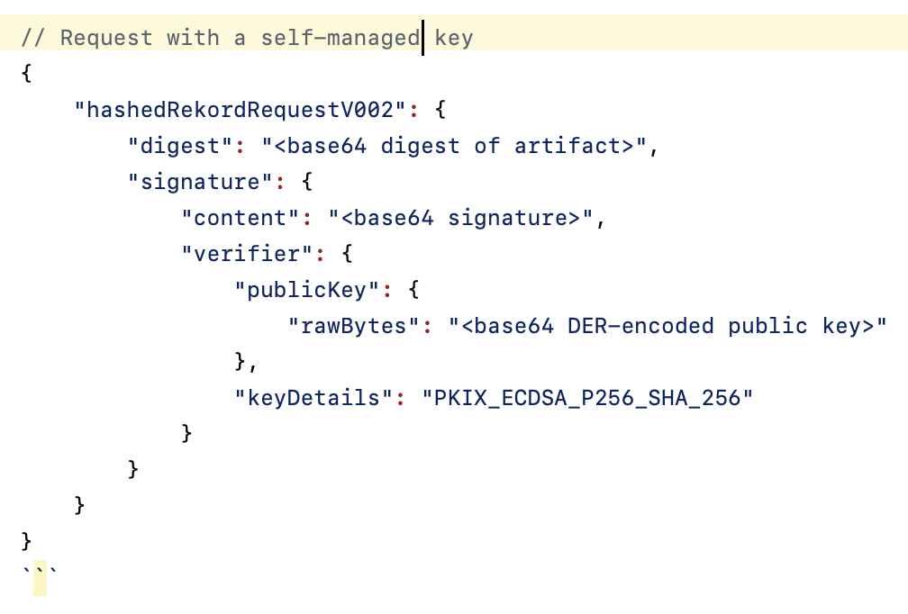

Rekor expects a structured packed when we use the API endpoint to send a post request, We use the `hashedRekordRequestV002` with self signing using our own [private key](https://github.com/sigstore/rekor-tiles/blob/main/CLIENTS.md?plain=1#L36) ([private key packet shape](https://github.com/sigstore/rekor-tiles/blob/main/CLIENTS.md?plain=1#L36)), rather than using the packet shape that is signed using fulcio ([fulcio certificate packet shape](https://github.com/sigstore/rekor-tiles/blob/main/CLIENTS.md?plain=1#L20)), as our launch goal is to prove [RubyGems.org](https://rubygems.org/) witnessed and submitted an authenticated application event, not that the individual actor cryptographically signed the event through Fulcio.

usage of Rekor inside our project,

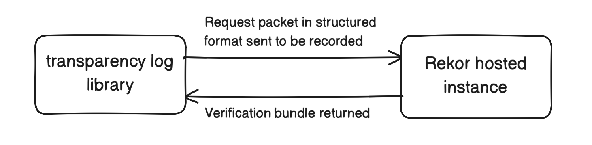

[Rekor Response](https://github.com/sigstore/rekor-tiles/blob/main/CLIENTS.md?plain=1#L491) is returned by the Rekor when any request is made. which consists of the root hash, the surrounding hashes, log index and similarly useful information that can be queried by the users to prove the presence of any event hash.

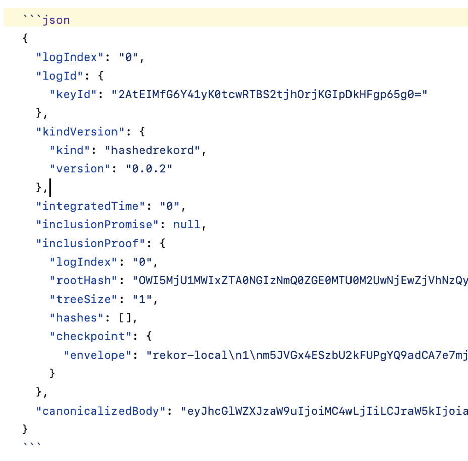

### Existing Ruby Client Library

The existing [Sigstore-Ruby Client Library](https://github.com/sigstore/sigstore-ruby/tree/main) to interact with the Rekor has [v1 endpoints](https://github.com/sigstore/sigstore-ruby/blob/main/lib/sigstore/rekor/client.rb#L27) and [public good instance packets](https://github.com/sigstore/sigstore-ruby/blob/main/lib/sigstore/models.rb#L235) hardcoded which is not what we intend to use hence does not satisfy our requirements so we fallback on creating a `transparency_log` library from scratch.

There are two core requirements that the new library has to fulfil,

* Creating the packet that Rekor API accepts in the [recommended v2 format](https://github.com/sigstore/rekor-tiles/blob/main/CLIENTS.md?plain=1#L36), with a self managed key.
* POST of the packet to the Rekor and return the [Rekor Response](https://github.com/sigstore/rekor-tiles/blob/main/CLIENTS.md?plain=1#L518) upwards in the call hierarchy.
* Use the new url that we want to set instead of the public good url.

### Transparency Log Library

The core responsibility of the Transparency Log Library is to extract the event details that we want to record,

* Construct a json packet in the [Rekor request packet shape](https://github.com/sigstore/rekor-tiles/blob/main/CLIENTS.md?plain=1#L36).
* Use client to post the Rekor request to hosted Rekor instance.
* Return the [Rekor Response](https://github.com/sigstore/rekor-tiles/blob/main/CLIENTS.md?plain=1#L518) upwards to be recorded further in the db.

The requirements to construct the [Rekor Request Packet Shape](https://github.com/sigstore/rekor-tiles/blob/main/CLIENTS.md?plain=1#L36),

* [Signer](https://github.com/amisha-chhajed/rubygems.org/blob/tlog/lib/transparency_log/signer.rb) - Responsible for generating the fields going inside the [Rekor Request Packet Shape](https://github.com/sigstore/rekor-tiles/blob/main/CLIENTS.md?plain=1#L36), also signs the digest with our private key.

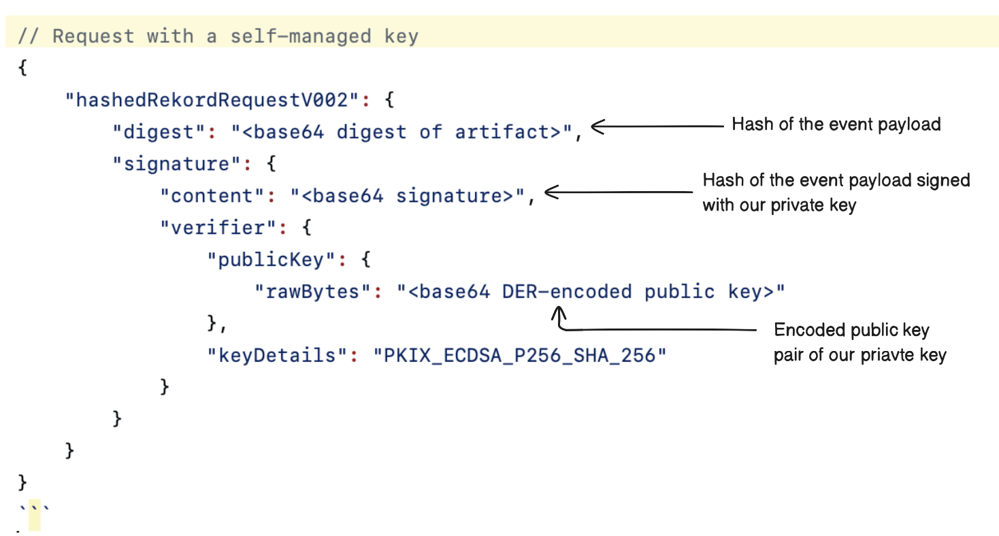

* [Entry Builder](https://github.com/amisha-chhajed/rubygems.org/blob/tlog/lib/transparency_log/entry_builder.rb) - Takes the fields returned by signer and constructs the structure of a Rekor Request.

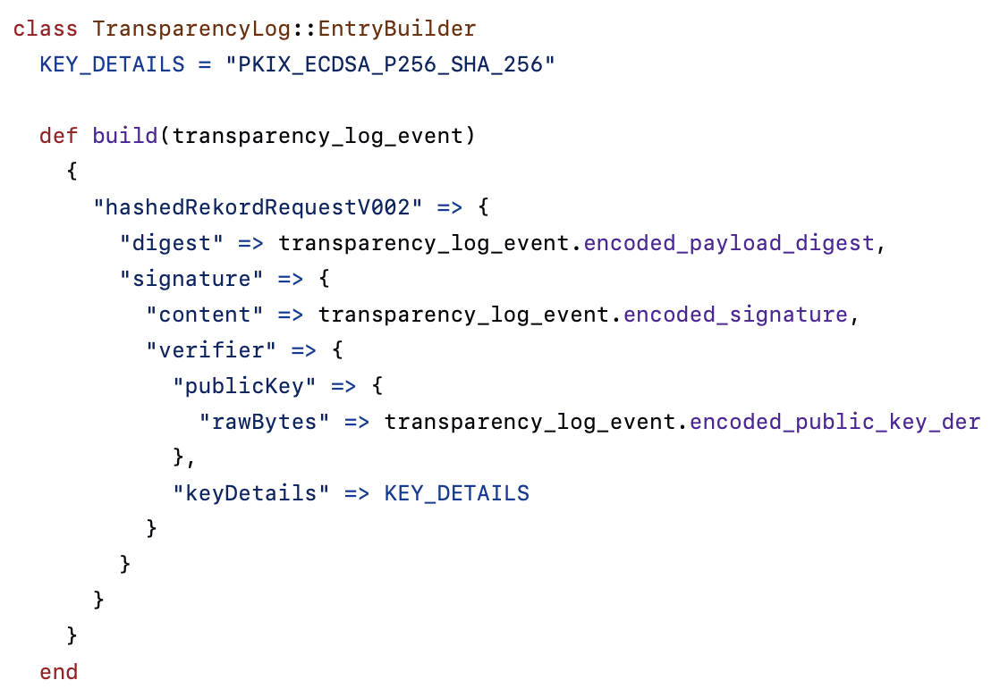

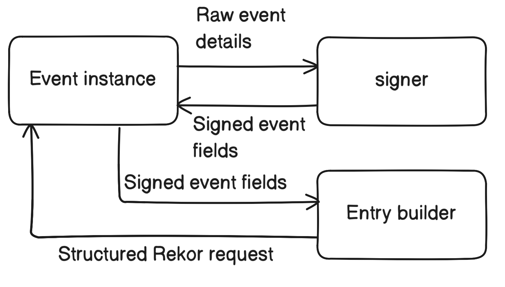

The requirements to POST constructed Rekor Request,

* [tlog](https://github.com/amisha-chhajed/rubygems.org/blob/tlog/lib/transparency_log/tlog.rb) - contains the [submit_entry](https://github.com/amisha-chhajed/rubygems.org/blob/tlog/lib/transparency_log/tlog.rb#L11) method called outside of the Transparency Log Library to record an event. It extracts only the [Rekor Request Field](https://github.com/amisha-chhajed/rubygems.org/blob/tlog/app/models/transparency_log_event.rb#L54) of the event instance and uses the post method of client on it.
* [client](https://github.com/amisha-chhajed/rubygems.org/blob/tlog/lib/transparency_log/client.rb) - contains the [internal post](https://github.com/amisha-chhajed/rubygems.org/blob/tlog/lib/transparency_log/client.rb#L19) method that posts the Rekor Request and returns the Rekor Response upwards back to tlog to record the response. Client is also responsible to raise error warnings based on what the type of error to facilitate the process of retrying based on the error class, example, to not retry in case of malformed entry as that shows a larger issue inside the API structure of the entry builder.

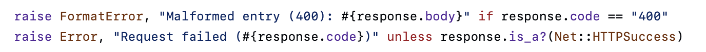

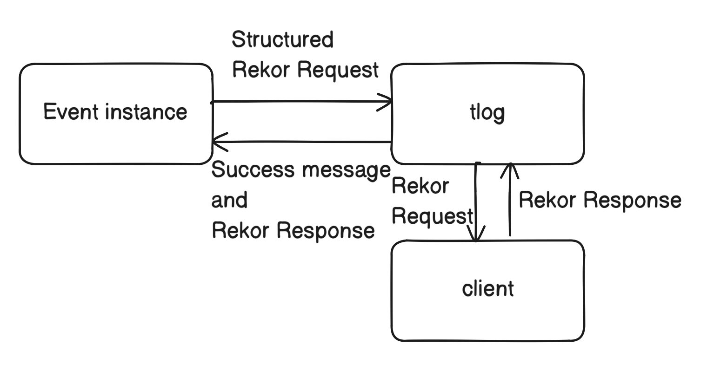

## Event Payload

[Event Canonical Payload](https://github.com/amisha-chhajed/rubygems.org/blob/tlog/app/models/transparency_log_event/canonical_payload.rb) represents the event metadata that is going to be the main data json that is intended to be recorded inside the Rekor.

The callsites of the events call [Rails Concern Recorder](https://github.com/amisha-chhajed/rubygems.org/blob/tlog/app/controllers/concerns/recorder.rb) which extracts the event attributes based on the event object type using a case based approach on the event object type, i.e if it is a 'Pusher', 'Deletion' or a 'User' object. The method of this file is called from the callsites of the event along with the `event_type` and `event_object`.

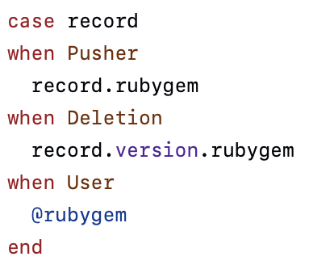

The [Rails Concern Recorder](https://github.com/amisha-chhajed/rubygems.org/blob/tlog/app/controllers/concerns/recorder.rb) after populating the necessary attributes inside the event instance calls the [Transparency Log Recorder](https://github.com/amisha-chhajed/rubygems.org/blob/tlog/lib/transparency_log/recorder.rb) which [creates the Event Canonical Payload](https://github.com/amisha-chhajed/rubygems.org/blob/tlog/lib/transparency_log/recorder.rb#L19) before populating other necessary fields.

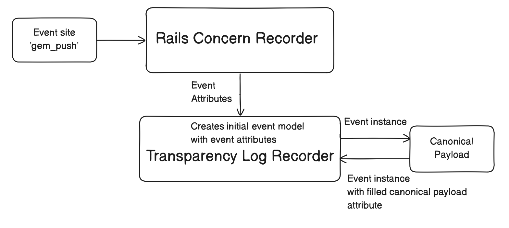

## Transparency Log Event Model

[Transparency Log Event Model](https://github.com/amisha-chhajed/rubygems.org/blob/tlog/app/models/transparency_log_event.rb) is the main model that holds fields that we intend to store in the database. We use an object instance of this model to transfer data between the callsite of an event(example: `gem_push`) and tlog which records it and then fills the [Rekor Response Attributes](https://github.com/amisha-chhajed/rubygems.org/blob/tlog/app/models/transparency_log_event.rb#L18).

[Transparency Log Event Model](https://github.com/amisha-chhajed/rubygems.org/blob/tlog/app/models/transparency_log_event.rb) has [IMMUTABLE_EVENT_ATTRIBUTES](https://github.com/amisha-chhajed/rubygems.org/blob/tlog/app/models/transparency_log_event.rb#L27) which are filled before the event is passed to tlog to be recorded the process of filling these attributes mainly happens inside [Transparency Log Recorder](https://github.com/amisha-chhajed/rubygems.org/blob/tlog/lib/transparency_log/recorder.rb).

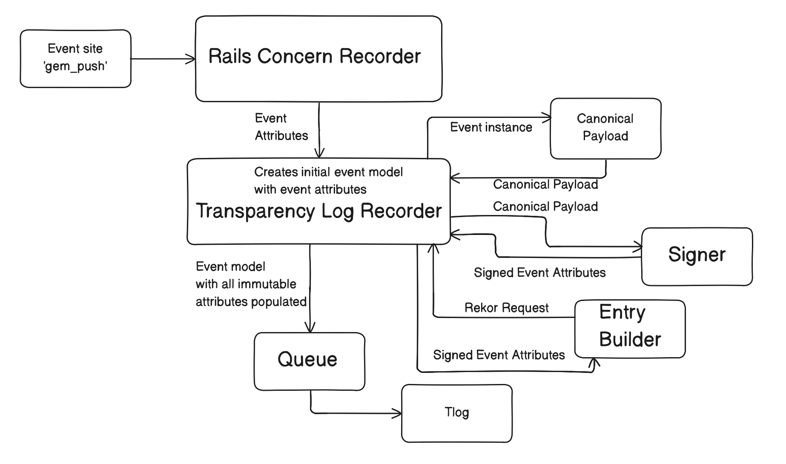

Once tlog records the event inside the Rekor it calls the [record_submission](https://github.com/amisha-chhajed/rubygems.org/blob/tlog/app/models/transparency_log_event.rb#L160) method that populates the [Rekor Response Fields](https://github.com/amisha-chhajed/rubygems.org/blob/tlog/app/models/transparency_log_event.rb#L18) and changes the status of the event submission from pending to submitted, [Process Transparency Log Event](https://github.com/amisha-chhajed/rubygems.org/blob/tlog/app/jobs/process_transparency_log_event_job.rb) queue retries the submissions based on the status of the submission and the error that tlog raises incase of a failed submission status.

The lifecycle of a Transparency Log Event instance can be illustrated as,

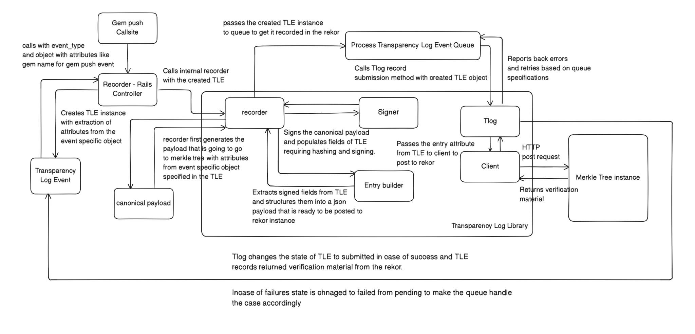

## Recording Of Events

The upcoming events would be recorded by the above mentioned flow.

We establish a baseline by recording all the events that happened previously in [RubyGems.org](https://rubygems.org/) by keeping the actor as system unlike the upcoming events where the actor would be recorded by inspecting the fields of the `@api_key`.

Once a database record is made it is immutable and we freeze it to avoid updation of anything once recorded.

## Verification And Querying

The existing [Sigstore-Ruby Client Library](https://github.com/sigstore/sigstore-ruby/tree/main) has an [implementation](https://github.com/sigstore/sigstore-ruby/blob/main/lib/sigstore/internal/merkle.rb) to use the hashes to verify inclusion with robust error handling and generalisation, we aim to write a very similar file for our library that can handle the math behind the verification process of using the verification bundle(Rekor Response) aptly to assert multiple operations like [verify_merkle_inclusion](https://github.com/sigstore/sigstore-ruby/blob/main/lib/sigstore/internal/merkle.rb#L27).

The events can be queried for presence by,

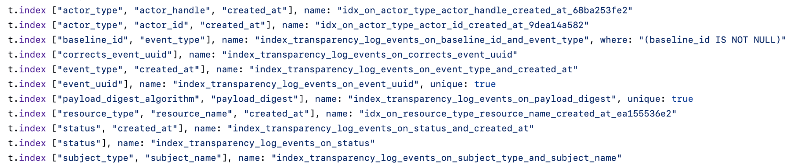

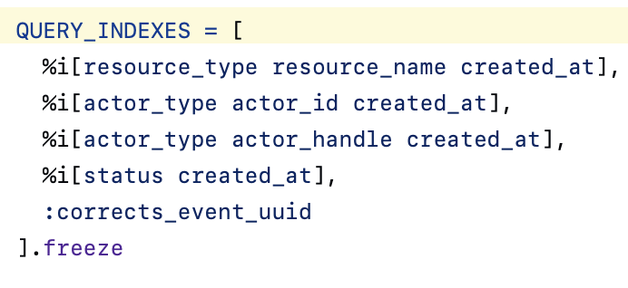

we can fetch the matching verification bundle using the above query indexes,

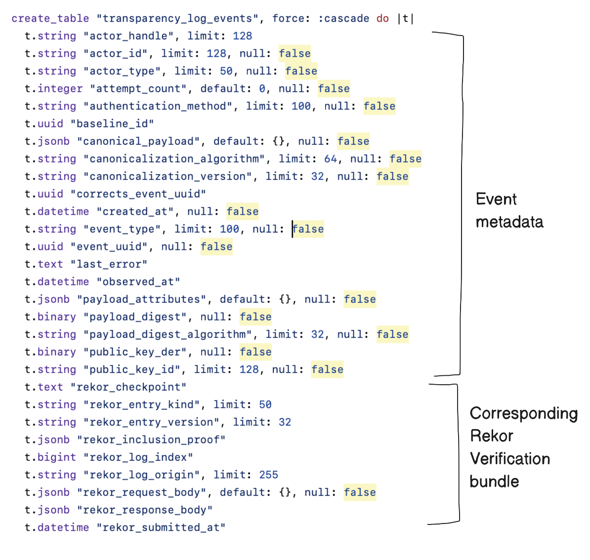

## Future Work

We have completed the part of recording the events inside the Merkle tree, hosting a Merkle tree, storing attributes that we can query in the db.

The part that we could continue working on,

* Developing and extending user APIs that provide users ways to query the db and retrieve relevant information.
* we can use the existing library's implementation without requiring significant re-write for the mathematics behind the verification process using hashes, and add API query methods that call these methods and retrieve the relevant verification material from the database for the given user and carry out the verification process using these methods and return the result of that process.

## Conclusion

We were successfully able to build a system that can record events that happen inside [RubyGems.org](https://rubygems.org/) inside a Merkle tree based immutable ledger. We also carried out research about the next steps for building the user facing APIs, and the code that could be used for the mathematics behind the verification process.

